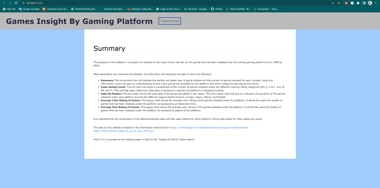

# Video Game Platform Analysis
## Data Analytics Bootcamp Project 3

Contributers: 

* Brandon Lee - [ht](https://github.com/JarrodCasey)
* David Cheung - [ht](https://github.com/tc831)
* Sarah Casauria - [ht](https://github.com/sarahcasauria)
* Dhiren Patel - [ht](https://github.com/dhirenkumarp)
* Maica Tran - [ht](https://github.com/MAICATRAN)

Video games have been entertaining households for more than 50 years. Over the years, more gaming platforms have been developed by various publishers including Microsoft, Nintendo, Playstation, and more.

For this project, we created a simple data visualisation app to aesthetically describe a range of aggregated data for a list of gaming platforms.

## Data Workflow

### Data Source
We sourced our data from [Kaggle](https://www.kaggle.com/), which stores publicly-accesible datasets to analyse. You can find our data [here](https://www.kaggle.com/datasets/sidtwr/videogames-sales-dataset). We used the [Video_Game_Sales_as_at_22_Dec_2016.csv](data/Video_Games_Sales_as_at_22_Dec_2016.csv) file for our analysis.

### Data Cleaning and Transformation
We used the Pandas module to import the `.csv` data into Jupyter Notebook. We then cleaned the data by removing any rows with null data in any of the columns, reducing the dataset from 16,700 rows to approximately 6,800 rows.

We then transformed the cleaned dataset to summarise key information based on gaming platform. We collected:

* mean sales by each sales region (North America, Japan, Europe, Other, Global)
* mean user score and critic score
* total games by rating and by genre

We then saved this summarised data into a new `.csv` for reference.

### Loading data into MongoDB
After summarising the desired data, we loaded the data into a local MongoDB database to test functionality. When successful, we then uploaded the data into a MongoDB Atlas database to serve the Flask app with the summarised data.

### Flask App Development
Using the PyMongo module and flask, we created an app file to connect to our MongoDB Atlas database and fetch the data and render HTML templates for our visualisation. To do this, we created three functions:

* Function to render the [index.html](templates/index.html) template
* Function to connect to the database and return the data as a `JSON` file
* Function to render the [visualisation.html](templates/visualisation.html) template with the data

You can view our app code [here](sales.py).

### JavaScript Development
For this project, we used three different JavaScript libraries to assist with visualising the data:

* D3.js
  *  Import `JSON` data from flask
  *  Append key data to a metadata table using HTML elements
*  Plotly.js
  *  Create gauge plots for critic and user scores
*  Chart.js
  *  Create bar plot for average sales by region
  *  Create pie charts for distribution of game ratings and genres

We created 6 different functions to build the webpage accordingly:

* Initialise visualisations with first platform loaded into dropdown
* Build metadata table
* Build stacked bar chart for average sales
* Build pie charts for distribution of ratings and genres
* Build gauge charts for critic and user scores
* Upon changing dropdown option, rebuild graphs for selected platform

You can view the JavaScript code [here](static/js/graphs.js).

### HTML design
We designed two webpages:

* A landing page describing our data and the project

* A visualisation page which loaded all the graphs and metadata. A dropdown menu was generated to be able to change the visualisation based on gaming platform.

### Visual Demonstration

## Conclusion
Based on our visualisation, we observed that Nintendo-based platforms are better suited for younger children and families, as they had higher numbers of games rated **E** for Everyone. On the other hand, XBox One had the highest proportion of **M** rated games for Mature audiences.

We faced many challenges during this project, including JavaScript errors, Flask app not connecting to MongoDB appropriately, and graphs not rendering correctly. However, with lots of troubleshooting and team discussion, we were able to create a working product.
